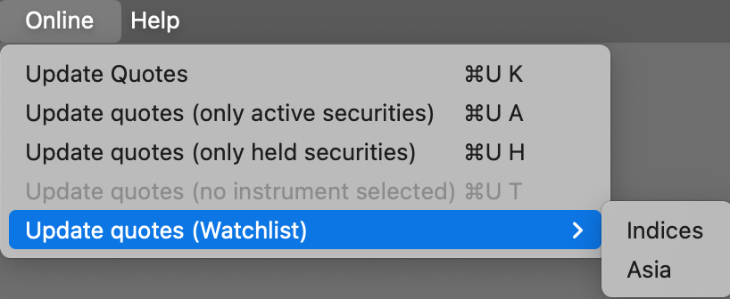

To assess the performance of your portfolio, it's essential to have historical prices or quotes for all securities. You can input these manually or, more conveniently, obtain them through a Quote Feed. This could be in the form of a table on a website or another online data source. With the menu `Online` these historical prices could be updated.

Figure: Menu Online.{class=pp-figure}

## Update quotes
For all securities that are connected to an online quote feed provider, this command will trigger a request to the online service for the latest quotes ranging from the first historical quote to the present day.

Quotes that were previously downloaded but subsequently deleted will be reinstated. However, quotes that have been manually altered after online download or those in the historical prices table that are not available online (e.g., quotes in the distant past) will remain unchanged during this operation.

A message `xxx operations remaining` will appear briefly in the left bottom corner of the window, indicating the progress of the updating process. This process is conducted in the background and does not affect other operations.

If you want more details about the updating process, there is a special [Price Update Status](./view/general-data/price-update-status.md) view available for inspection.

## Update quotes (only active securities)

Securities could be set to active or inactive in the Security Master Data tab of the Securities Attributes panel (see Figure 2, near the bottom).

Figure: Inactive setting in the Security Master Data tab.{class=pp-figure}

This command will update only the securities, with the option `Inactive`, turned off.

## Update quotes (only held securities)

With this menu, you can restrict price updates to securities you actually possess (hold) or those added to a watchlist (i.e. *without* recorded purchases).

## Update quotes (no instrument selected/xxx instruments selected)

In a table view such as All Securities, one can select one or more securities. For a consecutive selection, click the first row, press Shift, and click the last row. For a non-consecutive selection, use the Ctrl key.

The menu will display an indication (xxx) of the number of selected securities. Only those securities will be updated.

## Update quotes (Watchlist)

A [watchlist](../reference/file/new.md#watchlist) is a manually created group of
securities. In Figure 1, two watchlists have been set up (named `Indices` and `Asia`). With this menu, you can update the historical prices for the securities in these watchlists only.