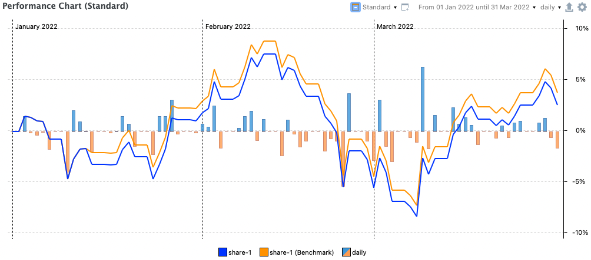

# Performance &rsaquo; Chart

Using the `View > Reports > Performance > Chart` menu or the sidebar menu, you can generate a graphical representation of your assets’ relative performance over time (see Figure 1). The x-axis represents time. You can select the desired reporting period using the dropdown menu in the top-right corner. By default, reporting periods of 1, 2, and 3 years are available. Additionally, you have the option to create a custom time period using the `New` feature. See [Reporting Period](../../../../concepts/reporting-period.md) for a description.

The y-axis represents cumulative performance as a percentage, starting from 0% at the beginning of the reporting period. It indicates the total increase or decrease in asset value compared to the previous period, which can be daily, weekly, monthly, quarterly, or yearly. The performance over a longer period is calculated by compounding the daily returns.

Figure: The daily performance chart of individual shares and the entire portfolio for a custom 2-year reporting period. {class=pp-figure}

For a detailed explanation of how cumulative performance is calculated, see the section on [time-weighted performance](../../../../concepts/performance/time-weighted.md). Since `share-2` was not purchased until September 30, 2022, its performance remains zero up to that date, implying that the performance of `share-1`and the portfolio are identical until then.

The user interface of the Performance Chart is similar to the chart interface of [View > Reports > Statement of Assets > Chart](../statement/statement-chart.md). For example, the context menu is identical. We cover only the differences in this section; see link above for the common features.

With the `Configure chart` icon (:gear: top right), you can add data series to the graph:

- Regular dataseries such as `share-1` as well as more `common` series such as `Entire portfolio`, `Entire portfolio (before taxes)`, or `daily`, `weekly`, `monthly`, ... portfolio performance. The latter represents a daily, monthly, ... bar chart diagram (see Figure 3) of the entire portfolio, displayed as periodic bars.  You can assign different colours to positive and negative performances via the legend’s context menu; e.g. `daily` in Figure 3.  
- Benchmarks such as share-1 (benchmark) (see Figure 2). A benchmark is a security used solely for its historical prices to calculate daily, monthly, ... and cumulative performance. Typically, a security with no purchase has a performance of zero. Therefore, a benchmark can be seen as a security with a single share, hypothetically purchased at the start of the reporting period. Naturally, this security does not affect overall portfolio performance.
 
The graph in Figure 2 misleadingly suggests a gradual performance increase in the first and second quarters of 2022. Since a line graph connects consecutive (quarterly) data points, it visually implies a continuous change in performance, even though only two data points have been calculated. You can verify this by left-clicking on the chart canvas within a quarter and moving the cursor left or right to change dates. The performance remains unchanged within each quarter.

Figure: Quarterly performance chart of share-1 and its benchmark. {class=pp-figure}

As can be seen in Figure 3, the increase in Q1 is not linear at all, but with ups and downs. Note that the performance starts at 0% because a new reporting period is selected (January 1 to March 31). 

Figure: Daily Performance chart of the first quarter of 2022. {class=pp-figure}

The graphs in Figure 2 & 3 also shows that the performance starts to diverge between `share-1` and its benchmark from Quarter 1, 2022 on. This occurs due to the first purchase of `share-1` on 2022-01-14. Remember that Portfolio Performance always calculates daily performance: `1 + r = (MVE + CFOut)/(MVB + CFIn)` [(Equation 1)](../../../../concepts/performance/money-weighted.md). The quarterly performance is just a compounding of daily performances.

- 2022-01-13 (day before the purchase): historical price of `share-1` increased from 16.016 EUR/share to 16.026 EUR/share. The daily performance of `share-1 (benchmark)` is thus (16.026 / 16.016) -1 = 0.0624%. This is the same performance as for the existing investment of 10 shares of `share-1`: ((160.26 + 0) / (160.16 + 0)) - 1 = 0.0624%. For days without cash flows, `share-1` and its benchmark have the same daily performance.
- 2022-01-14: the historical price drops from 16.026 to 15.962 EUR/share. The daily performance of `share-1 (benchmark)` decreases to (16.026 / 15.962) -1 = 0.040%. However, since an additional 5 shares are purchased on this day for 83 EUR (5 x 16 EUR/share + 3 EUR fees), the MVE of this security becomes 15 shares x 15.962 EUR/share = 239,43 EUR and the  daily performance = (( 239,43 + 0) / (160.26 + 83)) - 1 = -1.574%. Due to the fees, the benchmark has a better performance than the actual investment of 15 shares.
-  Please note that the performance as can be read from Figure 3 is the cumulative performance, and as such different from the daily performance as calculated above. For the cumulative performance, you need to compound the daily performances. For the benchmark: r14 = (1+r1)x(1+r2)x ... (1+r12)x(1+0.0624%)x(1-1,574%) = -2.07%. 
- The dividend payment on 2002-12-15 of 30 EUR (inclusive taxes) causes the second divergence. The historical prices decrease from 19.166 EUR/share to 18.898 EUR/share. So, the performance of the benchmark on december 15 is (18.898/19.166) - 1 = -1.40%. The performance of `share-1` is ((15 * 18.898) + 30) / (15 * 19.166) = 9.04%.
- The sell transaction occurred on 2023-04-12: 5 shares at 22.4 EUR/share minus 5 EUR fees or 107 EUR. The performance of the benchmark at the time of the sell transaction on 2023-04-12 is (22.40/22,60) - 1 = -0,88%. The performance of `share-1` is ((10 * 22.40) + 107) / (15 * 22,60) = 2,36%.  

Please refer to [View > Reports > Statement of Assets > Chart](../statement/statement-chart.md) for a description of the other features such as zooming, adding data series, context menu of the canvas and legend, and others.

